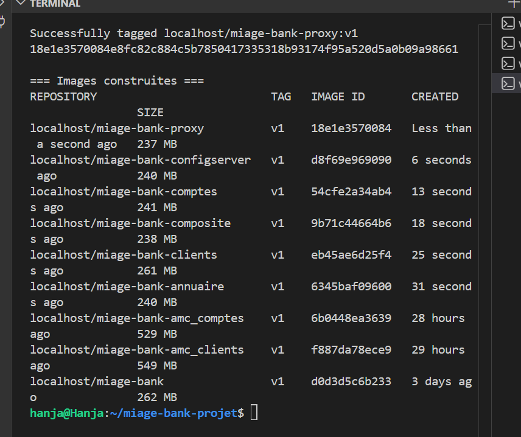

# Partie A — Étape 01 : Construction des images OCI avec Buildah

Cette étape couvre l'**analyse comparative Docker / Buildah** (livrable A.1) et la
**construction des images** des micro-services MIAGE-Bank avec Buildah (livrable A.2),
selon deux approches.

---

## 1. Pourquoi Buildah plutôt que Docker ? (Analyse A.1)

J'ai choisi **Buildah** plutôt que Docker pour construire les images de MIAGE-Bank.
Voici les différences fondamentales qui justifient ce choix.

### Architecture : démon vs daemonless

Docker repose sur un **démon** (`dockerd`) qui tourne en permanence en tant que root
et centralise tous les builds via un socket Unix (`/var/run/docker.sock`). Le client
`docker` ne fait que dialoguer avec ce service. Buildah est **daemonless** : c'est un
simple binaire invoqué à la demande, chaque build étant un processus éphémère, sans
service central. Buildah peut en plus s'exécuter en **rootless** grâce aux *user
namespaces* du noyau Linux, donc sans aucun privilège root sur la machine.

### Sécurité : surface d'attaque et privilèges

Le démon Docker constitue un point unique tournant en root : quiconque accède au socket
`docker.sock` obtient de fait un accès root à l'hôte (montage de `/`, conteneur
privilégié…). C'est une surface d'attaque majeure, particulièrement risquée lorsque ce
socket est exposé dans un conteneur de CI. Buildah supprime ce vecteur : pas de démon,
pas de socket, et l'exécution rootless limite les droits du build à ceux de
l'utilisateur courant. Le risque d'escalade de privilèges est donc fortement réduit.

### Conformité OCI

Buildah produit des images au format **OCI** (ou Docker v2 au choix), totalement
interopérables : elles se poussent vers n'importe quel registre et se lancent
indifféremment avec Podman, Docker ou tout runtime OCI (containerd, CRI-O…). Buildah
consomme par ailleurs un `Containerfile` à la syntaxe identique à celle d'un
`Dockerfile`, ce qui rend la migration transparente.

### Cas d'usage CI/CD

C'est là que Buildah prend tout son sens : dans un runner GitHub/GitLab ou un pod
Kubernetes, il évite le pattern *Docker-in-Docker* (montage du socket ou conteneur
privilégié), qui est une faille classique. Builder en rootless est plus sûr, plus
reproductible, et s'aligne avec les politiques de sécurité des clusters (PodSecurity,
absence de privilèges). C'est pourquoi j'ai retenu Buildah pour la chaîne de build de
MIAGE-Bank.

---

## 2. Construction des images (A.2)

MIAGE-Bank est un projet **Maven multi-module** (Spring Cloud) regroupant plusieurs
micro-services dans `src/AMSC/` : `amc_annuaire`, `amc_clients`, `amc_comptes`,
`amc_composite`, `amc_configserver`, `amc_proxy`. Chaque module produit un JAR
exécutable dans son dossier `target/`.

J'ai documenté **deux approches**, comme demandé.

### Approche 1 — via un Containerfile (recommandée)

J'utilise un **unique Containerfile générique** pour tous les services. Le JAR à
embarquer est passé en argument de build (`JAR_FILE`), ce qui rend le fichier
réutilisable pour n'importe quel micro-service.

```dockerfile
FROM eclipse-temurin:17-jre-alpine

LABEL org.opencontainers.image.title="miage-bank" \
      org.opencontainers.image.source="https://github.com/hialmar/AMSC"

# Utilisateur non-root : réduit la surface d'attaque et exigé par les bonnes
# pratiques Kubernetes (Partie B)
RUN addgroup -S app && adduser -S -G app app

WORKDIR /app
ARG APP_PORT=8080
EXPOSE ${APP_PORT}

ARG JAR_FILE
COPY --chown=app:app ${JAR_FILE} /app/app.jar

USER app
ENTRYPOINT ["java", "-jar", "/app/app.jar"]
```

Choix techniques expliqués :

- **`eclipse-temurin:17-jre-alpine`** : image de base légère (JRE seul, pas le JDK
  complet, sur Alpine). C'est ce qui divise par deux la taille finale et réduit le
  nombre de CVE.
- **Utilisateur non-root (`app`)** : bonne pratique de sécurité, recommandée par
  Hadolint et indispensable côté Kubernetes.
- **`COPY --chown` en une seule couche** : pas de fichier ni de cache résiduel, ce qui
  maximise l'efficacité mesurée par Dive.

Le build de tous les services est automatisé par `ci-scripts/build-images.sh`, qui
**découvre tout seul** les JAR dans `src/AMSC/*/target/` et construit une image par
service :

```bash
./ci-scripts/build-images.sh v1
```

### Approche 2 — Buildah natif, couche par couche (sans Containerfile)

J'ai aussi reconstruit une image « à la main » avec les commandes natives de Buildah
(`from`, `copy`, `config`, `commit`), pour le service `amc_clients` en exemple. Le
résultat est strictement équivalent à l'approche Containerfile. Script :
`ci-scripts/build-native.sh`.

```bash
container=$(buildah from eclipse-temurin:17-jre-alpine)
buildah run    $container -- addgroup -S app
buildah run    $container -- adduser -S -G app app
buildah copy   --chown app:app $container src/AMSC/amc_clients/target/amc_clients-0.0.1-SNAPSHOT.jar /app/app.jar
buildah config --workingdir /app --user app --port 8080 \
               --entrypoint '["java","-jar","/app/app.jar"]' $container
buildah commit $container localhost/miage-bank-clients-native:v1
buildah rm     $container
```

### Comparaison des deux approches

| Critère | Containerfile | Buildah natif |
|---|---|---|
| Lisibilité / maintenabilité | élevée (fichier versionné) | plus verbeuse |
| Reproductibilité | excellente | bonne |
| Scriptabilité fine | limitée | totale (logique bash) |
| Image produite | **identique** | **identique** |

Conclusion : les deux produisent une image OCI équivalente. Le Containerfile est plus
clair et plus maintenable (à privilégier dans la CI) ; le mode natif est utile pour des
builds dynamiques ou conditionnels pilotés par un script.

### Résultat

Six images ont été construites avec succès :

```
localhost/miage-bank-proxy:v1          237 MB
localhost/miage-bank-configserver:v1   240 MB
localhost/miage-bank-comptes:v1        241 MB
localhost/miage-bank-composite:v1      238 MB
localhost/miage-bank-clients:v1        261 MB
localhost/miage-bank-annuaire:v1       240 MB
```

À titre de comparaison, mes images de la version précédente (base JDK complète, copie
non optimisée) pesaient **~530–550 MB** par service. Le passage à une base JRE Alpine et
une copie en une seule couche a donc **divisé la taille par deux** (ex. clients :
549 MB → 261 MB). Cette optimisation est détaillée dans l'étape 03 (audit Dive).

Captures associées : 

