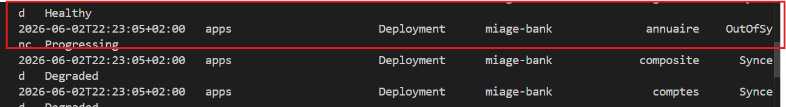
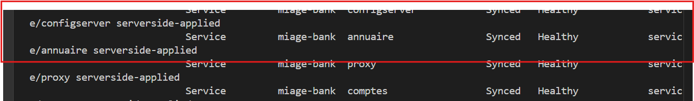

# Partie B — Packaging Helm & Déploiement Kubernetes de MIAGE-Bank

## Architecture déployée

MIAGE-Bank est déployé sur **Minikube** via un chart Helm dans le namespace `miage-bank`,
exposé via un **Ingress Traefik**, sécurisé avec **Vault + ESO** pour les secrets, et
synchronisé en continu par **ArgoCD**.

| Composant | Rôle | Outil |
|---|---|---|
| Chart Helm | Packaging et déploiement | Helm 3.20 |
| Ingress | Exposition externe | Traefik v3.7.1 |
| Secrets | Credentials DB depuis Vault | HashiCorp Vault + ESO |
| GitOps | Synchronisation Git → K8s | ArgoCD v3.4.3 |
| Autoscaling | HPA CPU/mémoire | K8s autoscaling/v2 |

---

## Prérequis

```bash
minikube start --memory=4096 --cpus=2
minikube addons enable metrics-server   # requis pour HPA

# Traefik
helm repo add traefik https://traefik.github.io/charts && helm repo update
helm install traefik traefik/traefik --namespace traefik --create-namespace

# ArgoCD
kubectl create namespace argocd
kubectl apply -n argocd \
  -f https://raw.githubusercontent.com/argoproj/argo-cd/stable/manifests/install.yaml

# Vault (mode dev — TP uniquement)
helm install vault hashicorp/vault --namespace vault --create-namespace \
  --set "server.dev.enabled=true" --set "server.dev.devRootToken=root"

# External Secrets Operator
helm install external-secrets external-secrets/external-secrets \
  --namespace external-secrets --create-namespace
```

Chargement des images MIAGE-Bank (buildées en Partie A) :
```bash
for svc in annuaire clients comptes composite configserver proxy; do
  buildah push localhost/miage-bank-$svc:v1 docker-archive:/tmp/mb-$svc.tar
  minikube image load /tmp/mb-$svc.tar && rm /tmp/mb-$svc.tar
done
```

---

## 1. Chart Helm MIAGE-Bank

### Structure

```
Partie B/miage-bank/
├── Chart.yaml
├── values.yaml              — pas de secret en clair
├── values-prod.yaml         — surcharges production
└── templates/
    ├── _helpers.tpl
    ├── namespace.yaml
    ├── serviceaccount.yaml  — SA + Role + RoleBinding (least privilege)
    ├── configmap.yaml       — URLs Spring Cloud
    ├── secret.yaml          — secret natif (fallback si ESO non disponible)
    ├── deployment.yaml      — 6 micro-services via range
    ├── service.yaml         — 6 Services ClusterIP via range
    ├── ingress.yaml         — Traefik → proxy:10000
    ├── networkpolicy.yaml   — default-deny + allow-traefik + intra-namespace
    ├── hpa.yaml             — HPA CPU/mémoire par service
    ├── mysql.yaml
    └── mongodb.yaml
```

### Validation pré-déploiement

```bash
helm lint miage-bank/
# → 0 chart(s) failed ✅

helm template miage-bank miage-bank/ | grep "^kind:" | sort | uniq -c
# → 1 ConfigMap, 8 Deployments, 1 Ingress, 1 Namespace,
#   3 NetworkPolicy, 1 Role, 1 RoleBinding, 1 Secret,
#   8 Services, 1 ServiceAccount, HPA si activés

helm install miage-bank miage-bank/ -n miage-bank --dry-run --create-namespace
# → STATUS: pending-install ✅
```

---

## 2. Déploiement Kubernetes

### Ressources déployées

```bash
helm list -n miage-bank
# NAME  NAMESPACE   REVISION  STATUS    CHART             APP VERSION
# miage-bank  miage-bank  2  deployed  miage-bank-1.0.0  v1
```

| Ressource | Nombre | Détail |
|---|---|---|
| Deployments | 8 | 6 micro-services + MySQL + MongoDB |
| Services ClusterIP | 8 | 1 par service |
| Ingress | 1 | Traefik → proxy:10000 |
| NetworkPolicy | 3 | default-deny, allow-traefik, intra-namespace |
| HPA | configurables | CPU ≤ 70%, mémoire ≤ 80% |
| ServiceAccount | 1 | miage-bank-sa (least privilege) |
| Role + RoleBinding | 1+1 | lecture seule pods/services/configmaps |

### NetworkPolicy

```bash
kubectl get networkpolicies -n miage-bank
# default-deny-ingress    → bloque tout trafic entrant
# allow-from-traefik      → autorise Traefik → proxy
# allow-intra-namespace   → communication entre pods
```

### HPA (Horizontal Pod Autoscaler)

L'autoscaling est activé via `values.yaml`. Il nécessite `metrics-server` :
```bash
minikube addons enable metrics-server
kubectl get hpa -n miage-bank
```

### Ingress Traefik

```bash
kubectl get ingress -n miage-bank
# miage-bank-ingress  traefik  miage-bank.local

echo "$(minikube ip) miage-bank.local" | sudo tee -a /etc/hosts
```

---

## 3. Gestion des secrets — Vault + External Secrets Operator

### Architecture

```
HashiCorp Vault (dev)
    └── secret/miage-bank/db
            ├── mysql-password: root
            └── mongo-password: root
                    ↓ (ClusterSecretStore)
         External Secrets Operator
                    ↓ (ExternalSecret)
         K8s Secret "miage-bank-db-secret"
                    ↓
         Pods (via secretKeyRef)
```

### Configuration Vault

```bash
# Écriture des credentials dans Vault
kubectl exec -n vault vault-0 -- \
  env VAULT_TOKEN=root vault kv put secret/miage-bank/db \
  mysql-password=root \
  mongo-password=root

kubectl exec -n vault vault-0 -- \
  env VAULT_TOKEN=root vault kv get secret/miage-bank/db
```

### ClusterSecretStore + ExternalSecret

```bash
# Token Vault pour ESO
kubectl create secret generic vault-token \
  --from-literal=token=root -n miage-bank

# ClusterSecretStore (connexion ESO → Vault)
kubectl apply -f 01-infrastructure/cluster-secret-store.yaml

# ExternalSecret (synchronisation Vault → K8s Secret)
kubectl apply -f 01-infrastructure/external-secret.yaml
```

Vérification :
```bash
kubectl get clustersecretstore vault-backend
# NAME           STATUS  READY
# vault-backend  Valid   True  

kubectl get externalsecret -n miage-bank
# NAME                    STATUS        READY
# miage-bank-db-external  SecretSynced  True  
```

Les credentials **ne figurent jamais en clair** dans `values.yaml` ni dans le chart.
Vault est la source unique de vérité pour les secrets.

> **Note :** Vault est déployé en mode **dev** (TP uniquement, données non persistées).
> En production : mode serveur HA avec stockage persistant (Consul ou Raft).

---

## 4. GitOps avec ArgoCD

### Bootstrap (l'œuf ou la poule)

ArgoCD ne peut pas se déployer via lui-même — c'est le problème de bootstrap classique.
Il a été installé **une seule fois manuellement** via `kubectl apply`. Ensuite, ArgoCD
gère tous les déploiements depuis Git, y compris ses propres mises à jour potentielles.

### Application ArgoCD

```bash
kubectl apply -f 01-infrastructure/argocd-app.yaml
argocd app list
# NAME               STATUS  HEALTH    SYNCPOLICY
# argocd/miage-bank  Synced  Degraded  Auto-Prune
```

Configuration (`argocd-app.yaml`) :
```yaml
syncPolicy:
  automated:
    prune: true      # supprime les ressources retirées du chart
    selfHeal: true   # corrige toute dérive automatiquement
```

**Statut Degraded :** certains pods Spring Boot redémarrent en attendant que leurs
dépendances soient prêtes (configserver, bases de données). Les ressources
d'infrastructure (NetworkPolicy, RBAC, Services, Ingress) sont toutes `Healthy`.

---

## 5. Démonstration de dérive ArgoCD

```bash
# 1. Désactiver temporairement l'auto-sync
argocd app set miage-bank --sync-policy none

# 2. Créer la dérive manuellement
kubectl scale deployment annuaire --replicas=3 -n miage-bank
# → ArgoCD détecte : annuaire OutOfSync 

# 3. Réconciliation
argocd app sync miage-bank
# → annuaire Synced , retour à 1 réplica en 1 seconde

# 4. Réactiver l'auto-sync
argocd app set miage-bank --sync-policy automated --self-heal --auto-prune
```

**Résultat :** dérive détectée en < 5 secondes, réconciliation en 1 seconde.
Avec `selfHeal: true`, toute dérive future est corrigée **automatiquement**.

Captures disponibles : `argocd-synced.png` (UI ArgoCD), sorties terminales.





---

## Livrables

- [x] Chart Helm complet (14 templates + HPA)
- [x] `values.yaml` sans secret, `values-prod.yaml`
- [x] Secrets gérés via Vault + External Secrets Operator
- [x] NetworkPolicy (default-deny + allow-traefik + intra-namespace)
- [x] RBAC (ServiceAccount + Role + RoleBinding least privilege)
- [x] HPA (autoscaling CPU/mémoire)
- [x] Ingress Traefik → proxy (miage-bank.local)
- [x] Application ArgoCD synchronisée sur `main`
- [x] Démonstration de dérive OutOfSync → Synced