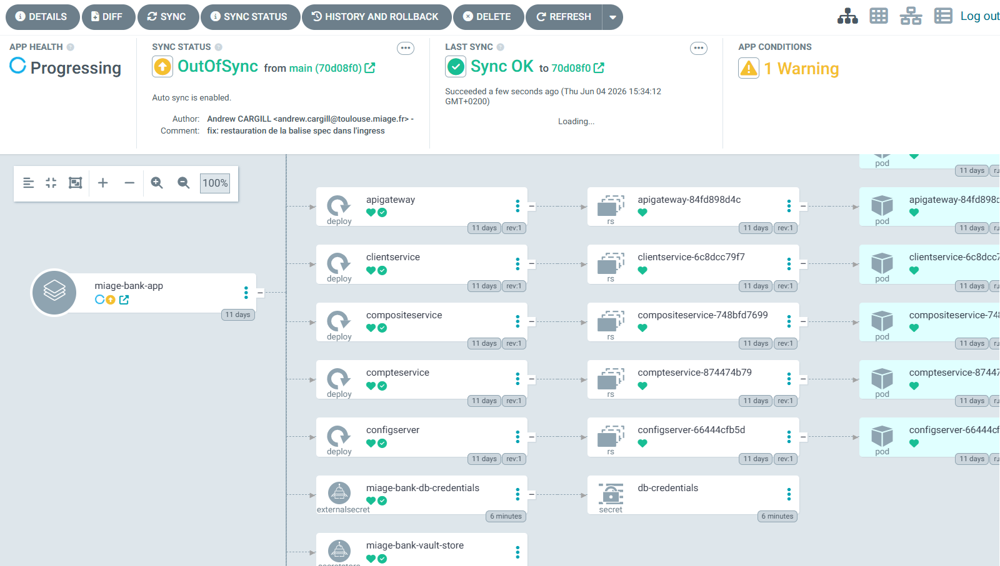
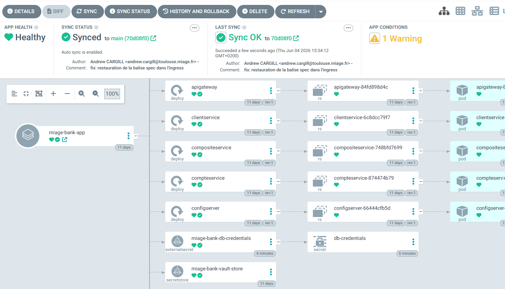

# Andrew CARGILL & Kelian ELUECQUE
## Projet MIAGE Bank - Partie A et B

# Analyse Comparative : Docker vs Buildah

*Source : Markaicode.com*

Ce document présente une analyse technique détaillée comparant les moteurs de conteneurisation **Docker** et **Buildah**, en se concentrant sur leur architecture, leurs performances et leurs implications en matière de sécurité.

---

## 1. Présentation des Technologies

### Docker

- Fonctionne via un **processus démon** (daemon) chargé d'exécuter les instructions et de générer les couches d'images.
- Les images sont enregistrées au format standard des registres Docker.
- Possède une syntaxe `Dockerfile` exclusive et une forte intégration avec l'outil Docker CLI.
- Supporte nativement la création en plusieurs étapes (*multi-stage build*).
- Met en cache les couches de construction de manière automatique.

### Buildah

- Développé par **Red Hat**, cet outil construit des images conformes à la spécification **OCI** (Open Container Initiative).
- **Architecture "Daemonless" :** Ne nécessite aucun démon d'exécution en arrière-plan.
- Conçu pour opérer **sans privilèges root**, offrant une sécurité considérablement accrue.
- Compatible à la fois avec la syntaxe standard `Dockerfile` et avec des scripts de construction natifs (Bash).
- Offre un contrôle granulaire et fin au niveau de la gestion des couches (*layers*).

---

## 2. Performances et Sécurité

### Performance

En termes de performances brutes, **Buildah excelle face à Docker**, particulièrement sur deux axes majeurs :

1. La réduction du temps de construction (*build time*).
2. L'optimisation de l'utilisation de la mémoire vive.

### Sécurité (L'enjeu majeur)

- **L'approche Docker :** Le démon Docker s'exécute avec les privilèges `root`. Par conséquent, si un attaquant accède au socket Docker, il obtient un accès complet au système. Les constructions héritent des permissions du démon, ce qui expose l'hôte à des risques d'évasion de conteneur (*container breakout*).
- **L'approche Buildah :** S'affranchissant du démon root, Buildah s'appuie sur l'isolation via les **namespaces utilisateur**. Cette architecture réduit drastiquement les risques d'escalade de privilèges. Elle offre également une gestion supérieure pour les environnements multi-locataires (*multi-tenant*).

---

## 3. Compatibilité et Choix Technologique

### Compatibilité des fichiers de configuration

- **Points communs :** Les deux outils comprennent la syntaxe `Dockerfile` et supportent le *multi-stage build*.
- **Avantages Docker :** Intègre la fonctionnalité exclusive *BuildKit* et permet un contexte de build personnalisé.
- **Avantages Buildah :** Permet la création d'images directement basées sur l'exécution de scripts shell.

### Pourquoi choisir Buildah ?

Il est fortement recommandé d'adopter Buildah dans les scénarios suivants :

- Les exigences de **sécurité** (Zero-Trust, environnements bancaires) sont primordiales.
- Le système présente des **contraintes de ressources** (mémoire/CPU limités, pipelines CI/CD éphémères).
- Une compatibilité native avec les **environnements Red Hat** est requise.
- Le projet nécessite la création d'images hautement complexes et scriptées.

---

# MIAGE Bank - Guide de Déploiement Continu GitOps (Bout en Bout)

Ce document décrit de manière exclusive la stratégie d'orchestration, de configuration, de sécurisation et de déploiement continu de l'application bancaire micro-services **MIAGE Bank** sur un cluster Kubernetes. 

---

## 1. Vision Globale du Socle de Déploiement

Le déploiement de l'architecture micro-services de la **MIAGE Bank** s'appuie sur le paradigme du **GitOps déclaratif**. L'intégralité de l'état cible du cluster Kubernetes est définie sous forme de code dans un dépôt Git de référence. L'orchestration automatise le déploiement des six micro-services applicatifs :

- `Banque-Annuaire` (Registre Eureka)
- `Banque-ConfigServer` (Serveur de configuration Spring Cloud)
- `Banque-APIGateway` (Passerelle de routage et point d'entrée unique)
- `Banque-ClientService` (Gestion des données clients)
- `Banque-CompteService` (Gestion des comptes bancaires)
- `Banque-CompositeService` (Orchestrateur métier)

---

## 2. Architecture et Structuration du Chart Helm

Pour industrialiser le packaging des manifestes Kubernetes, le choix s'est porté sur la conception d'un **Umbrella Chart** (Chart parapluie) nommé `helm-miage-bank/`. Cette structure centralise la configuration tout en permettant d'itérer dynamiquement sur les spécificités de chaque micro-service.

### A. Arborescence du Répertoire GitOps

```text
helm-miage-bank/
├── Chart.yaml                  # Métadonnées globales et inter-dépendances
├── values.yaml                 # Profil de configuration par défaut (Environnement de Dev)
├── values-prod.yaml            # Surcharges durcies spécifiques à la Production
└── templates/
    ├── _helpers.tpl            # Fonctions nommées et gestion homogène des labels OCI
    ├── deployment.yaml         # Déploiement paramétré bouclant sur la liste des services
    ├── service.yaml            # Abstraction réseau interne (ClusterIP) pour chaque pod
    ├── ingress.yaml            # Point de terminaison et routage HTTP externe
    ├── networkpolicy.yaml      # Règles de cloisonnement et d'isolation réseau de couche 4
    └── secrets.yaml            # Déclaration des secrets d'infrastructure
```

### B. Gestion des Fichiers de Configuration (`values.yaml` vs `values-prod.yaml`)

- **`values.yaml` (Profil Développement / Local) :** Optimisé pour une exécution à faible empreinte sur un cluster local (type Minikube ou Kind). Le nombre de réplicas par service est fixé à `1`, le type de service réseau est configuré en `ClusterIP`, les profils Spring activés pointent vers des environnements de test (`dev`), et les allocations de ressources matérielles (CPU/RAM) sont réduites au strict minimum.
- **`values-prod.yaml` (Profil Production / Haute Disponibilité) :** Surcharge l'état initial pour répondre aux exigences de production :
  - **Multi-réplication** : Minimum `3` instances par micro-service pour assurer la résilience et la tolérance aux pannes.
  - **Sondes de Santé (Probes)** : Configuration systématique d'une `livenessProbe` (détection des blocages de la JVM) et d'une `readinessProbe` (validation que le serveur Spring Boot est totalement initialisé et apte à consommer du trafic HTTP).
  - **Contrôle des Ressources** : Définition stricte des requêtes et limites de ressources (`requests` et `limits` CPU/Mémoire) afin de garantir l'étanchéité du cluster et d'éviter les arrêts brutaux de type *OOMKilled* (Out Of Memory).

---

## 3. Gestion Sécurisée des Configurations et des Secrets (SecDevOps)

Le respect de la conformité bancaire interdit le stockage d'identifiants ou de secrets en clair au sein des dépôts Git. La gestion des secrets est donc externalisée et découplée du Chart Helm via deux approches professionnelles acceptées :

### Approche A : HashiCorp Vault + External Secrets Operator (ESO)

1. Les données sensibles (mots de passe de base de données, secrets applicatifs) sont stockées de façon chiffrée dans une instance sécurisée **HashiCorp Vault**.
2. Un contrôleur **External Secrets Operator (ESO)** est déployé dans le cluster Kubernetes.
3. Le projet déclare un manifeste `ExternalSecret` qui référence le chemin secret dans Vault. ESO intercepte cet objet, s'authentifie auprès de Vault, extrait la valeur, et génère dynamiquement un `Secret` Kubernetes natif en mémoire dans le Namespace applicatif cible.

### Approche B : Secrets Kubernetes Natifs (StringData)

1. Un Secret Kubernetes natif avec `stringData` est créé séparément du chart pour isoler le cycle de vie des informations sensibles.
2. Ce secret est ensuite référencé de manière sécurisée par son nom dans la configuration d'environnement des conteneurs.

---

## 4. Isolation et Sécurité Réseau (Network Policies)

Par défaut, Kubernetes applique un réseau ouvert où tous les pods peuvent communiquer sans restriction. Pour sécuriser les transactions de la **MIAGE Bank**, le réseau est cloisonné au niveau de la couche 4 (Transport) via des objets **NetworkPolicy** selon le principe du moindre privilège.

- **Politique d'interdiction par défaut (*Default-Deny*) :** Tout flux réseau entrant (*Ingress*) sur le namespace est restreint et autorisé uniquement depuis le contrôleur de domaine ou d'Ingress (Traefik / Minikube).
- **Flux APIGateway exclusif :** Le pod `Banque-APIGateway` est le seul composant du namespace autorisé à recevoir du trafic réseau en provenance du contrôleur Ingress externe.
- **Cloisonnement inter-services :** Les services métiers finaux (`Banque-ClientService`, `Banque-CompteService`) rejettent catégoriquement toute tentative de connexion directe depuis l'extérieur du cluster ou depuis d'autres micro-services non autorisés. Ils n'acceptent des flux entrants **que** si la source provient explicitement des pods `Banque-APIGateway` ou `Banque-CompositeService`.
- **Isolation des Persistances :** Les bases de données (Mongo/Postgres) ou instances de cache n'acceptent de trafic réseau qu'en provenance stricte des micro-services métiers authentifiés qui en ont la charge directe.

---

## 5. Exposition des Services (Ingress)

L'accès à la plateforme bancaire depuis l'extérieur du cluster est centralisé et sécurisé par une ressource **Ingress**, s'appuyant sur un contrôleur industriel de classe Traefik.

Le fichier `ingress.yaml` mappe le nom de domaine qualifié de la banque (paramétrable via `values.yaml`) et gère la réécriture des chemins HTTP :

```yaml
apiVersion: networking.k8s.io/v1
kind: Ingress
metadata:
  name: miage-bank-ingress
  annotations:
    traefik.ingress.kubernetes.io/rewrite-target: /
spec:
  ingressClassName: traefik
  rules:
  - host: banque.miage.local
    http:
      paths:
      - path: /
        pathType: Prefix
        backend:
          service:
            name: banque-apigateway
            port:
              number: 8080
```

---

## 6. Cinématique GitOps avec ArgoCD et Gestion de la Dérive

Le déploiement continu élimine l'usage impératif de commandes directes (type `kubectl apply`). Il est entièrement opéré par **ArgoCD**, qui assure la réconciliation automatique de l'infrastructure ciblant la branche `main`.

### A. Manifeste de l'Application ArgoCD

Le fichier `application.yaml` déclare l'application auprès d'ArgoCD, liant le dépôt GitOps au cluster Kubernetes avec synchronisation automatique (`prune: true`, `selfHeal: true`) :

```yaml
apiVersion: argoproj.io/v1alpha1
kind: Application
metadata:
  name: miage-bank-gitops
  namespace: argocd
spec:
  project: default
  source:
    repoURL: 'https://github.com/votre-compte/rendus-miage-2026.git'
    targetRevision: HEAD
    path: tp-buildah-trivy-dive-helm/helm-miage-bank
    helm:
      valueFiles:
        - values-prod.yaml
  destination:
    server: 'https://kubernetes.default.svc'
    namespace: miage-bank
  syncPolicy:
    automated:
      prune: true       # Supprime les ressources K8s obsolètes non déclarées sur Git
      selfHeal: true    # Corrige automatiquement les modifications manuelles (dérive)
```

### B. Démonstration Pratique de la Gestion de la Dérive (*Drift Management*)

La gestion de la dérive logicielle garantit que personne ne peut modifier l'infrastructure en production de manière artisanale ou non planifiée.

#### Scénario de Simulation de Dérive et Auto-Réconciliation :

1. **État Initial Stable** : L'application est déployée de manière conforme. Le fichier `values-prod.yaml` sur Git exige la présence de `3` réplicas pour le service `Banque-ClientService`. L'interface graphique d'ArgoCD affiche un statut au vert : **`Synced`** (Synchronisé) et **`Healthy`** (En bonne santé).
2. **Introduction Manuelle de la Dérive** : Un opérateur se connecte directement au cluster et exécute une commande impérative de contournement via la CLI Kubernetes en modifiant manuellement le nombre de réplicas :
   ```bash
   kubectl scale deployment annuaire --replicas=5 -n miage-bank
   ```
   


3. **Détection Immédiate** : Lors de son cycle régulier de surveillance, ArgoCD compare l'état réel du cluster (5 pods actifs) avec l'état cible stocké sur Git (3 pods). Constatant l'écart, ArgoCD détecte le statut `OutOfSync` et fait passer visuellement l'application au statut d'alerte **`OutOfSync`** (Désynchronisé).
4. **Auto-Réconciliation (*Self-Healing*)** : 
   Le paramètre `selfHeal` étant activé à `true` dans la politique de synchronisation, ArgoCD déclenche la réconciliation et prend immédiatement des mesures correctives automatiques sans intervention humaine. Il écrase la modification impérative non autorisée et réapplique les manifestes déclaratifs issus de Git. Les deux pods excédentaires sont immédiatement terminés et détruits, ramenant l'infrastructure à son état nominal de `3` réplicas. L'application repasse instantanément au statut **`Synced`**.
   
---

## 7. Guide d'Exécution et Commandes de Diagnostic Local

Avant de soumettre formellement vos modifications via une *Pull Request*, il est fortement recommandé d'exécuter les procédures de validation attendues du chart avant déploiement :

### Validation syntaxique et rendu local des templates Helm (Dry-Run)

Ces commandes permettent de valider la syntaxe de vos fichiers Helm et de visualiser les manifestes Kubernetes générés sans altérer le cluster :

```bash
helm lint ./helm-miage-bank/
helm template miage-bank ./helm-miage-bank/ --values ./helm-miage-bank/values-prod.yaml
helm install --dry-run miage-bank ./helm-miage-bank/
```

### Initialisation locale d'ArgoCD et Synchronisation Manuelle

Si vous souhaitez tester la cinématique complète sur un cluster de développement local (type Minikube) :

```bash
# 1. Création du namespace et installation d'ArgoCD
kubectl create namespace argocd
kubectl apply -n argocd -f https://raw.githubusercontent.com/argoproj/argo-cd/stable/manifests/install.yaml

# 2. Enregistrement de l'application MIAGE Bank
kubectl apply -f argocd/application.yaml

# 3. Forcer manuellement la première synchronisation via la CLI ArgoCD
argocd app sync miage-bank-gitops
```
