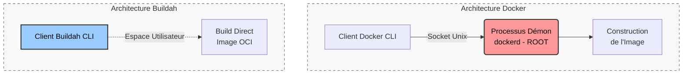

## Analyse comparative : Docker vs Buildah

Bien que Docker ait démocratisé la conteneurisation, son architecture historique présente des limites structurelles, particulièrement dans des environnements d'intégration continue (CI/CD) et de haute sécurité. **Buildah** a été conçu spécifiquement pour pallier ces faiblesses lors de la phase de construction des images.

### Architecture : Modèle Démon vs Daemonless

* **Docker** repose sur une architecture client-serveur centralisée. La commande `docker` n'est qu'un client qui communique avec un processus lourd exécuté en arrière-plan : le **démon Docker** (`dockerd`). Ce démon doit tourner en permanence pour gérer l'intégralité du cycle de vie des conteneurs (build, exécution, réseau, volumes).
* **Buildah**, à l'inverse, adopte une approche **daemonless** (sans démon). C'est un utilitaire en ligne de commande (CLI) autonome et éphémère. Il s'exécute uniquement au moment de la construction de l'image et s'arrête immédiatement après. De plus, Buildah opère directement dans l'**espace utilisateur** (user-space), sans dépendre d'un processus central.

### Sécurité : Surface d'attaque et privilèges

* **Docker :** Par défaut, le démon Docker s'exécute avec les privilèges `root` sur la machine hôte. Pour que le client interagisse avec le démon, il utilise le socket Unix local (`/var/run/docker.sock`). Si un conteneur ou un utilisateur malveillant parvient à compromettre ce socket, il obtient un accès `root` complet sur le serveur hôte. Ce risque majeur d'escalade de privilèges élargit considérablement la surface d'attaque. **C'est d'ailleurs pour cette raison qu'il est aujourd'hui fortement déconseillé d'utiliser le démon Docker classique directement sur des environnements de production, au profit de solutions "daemonless" et "rootless" comme Podman.**
* **Buildah :** Il a été conçu avec le paradigme **Rootless** (sans droits administrateur) au cœur de son fonctionnement. Grâce à l'utilisation des *user namespaces* du noyau Linux, un développeur peut construire, modifier et pousser une image en tant qu'utilisateur standard. L'absence totale de démon et de socket exposé réduit la surface d'attaque à son strict minimum.

### Conformité OCI (Open Container Initiative)

* **Qu'est-ce que l'OCI ?** Pour faire simple, l'OCI est un standard ouvert qui définit les règles de fabrication pour que toutes les images aient exactement la même structure.
* Contrairement à Docker qui a historiquement géré son propre écosystème, Buildah est un outil dont l'unique but est de construire des images respectant scrupuleusement ce standard **OCI**.
* Il n'existe donc pas d'"images Buildah". L'outil produit des images OCI universelles. Cette conformité stricte garantit une **interopérabilité totale** : peu importe l'outil qui l'a construite, l'image peut être exécutée indifféremment par Docker, Podman, ou par les moteurs de Kubernetes (**containerd** ou **CRI-O**).

### Cas d'usage CI/CD : Pertinence dans des environnements Rootless

La différence d'architecture devient un enjeu critique dans les pipelines d'intégration continue (GitHub Actions, GitLab CI) :
* **Le problème de Docker :** Pour construire une image Docker *à l'intérieur* d'un pipeline conteneurisé (approche **DinD** - *Docker in Docker*), le conteneur de CI doit impérativement s'exécuter avec le flag `--privileged` ou en montant le socket Docker de l'hôte. Dans un cluster Kubernetes partagé, accorder ce niveau de privilège à un job éphémère est une aberration de sécurité.
* **L'avantage décisif de Buildah :** Grâce à sa nature *daemonless* et *rootless*, Buildah s'exécute nativement et de manière totalement sécurisée à l'intérieur d'un conteneur non privilégié. Il s'impose donc comme l'outil standard de l'industrie pour la construction d'images dans des environnements CI/CD Cloud Native. L'adoption de Buildah s'inscrit ainsi parfaitement dans la philosophie **DevSecOps**, en intégrant la sécurité ("by design") et l'isolation dès la toute première étape de construction de l'application.

### Tableau de synthèse

| Critère | Docker | Buildah |
| :--- | :--- | :--- |
| **Architecture** | Client-Serveur (nécessite un démon lourd) | CLI autonome (*Daemonless*) |
| **Exécution** | Espace noyau (souvent *root*) | Espace utilisateur (*User-space*) |
| **Sécurité (CI/CD)** | Risquée (*Docker-in-Docker* requiert `--privileged`) | Sécurisée (*Rootless* natif) |
| **Surface d'attaque** | Large (Socket Unix vulnérable) | Très réduite (Pas de processus en tâche de fond) |
| **Standardisation** | Format Docker (historique) compatible OCI | 100% strict OCI |

### Architecture visuelle : Docker vs Buildah

### Conclusion

L'utilisation de Buildah nous permet de garantir une chaîne de construction (CI/CD via GitHub Actions) totalement reproductible, isolée, et sans aucun privilège administrateur, répondant ainsi aux exigences modernes du Cloud Native. C'est un avantage décisif face à Docker, qui imposerait l'exécution d'un démon persistant en tâche de fond et l'ouverture de failles de sécurité critiques (via l'obligation d'utiliser le mode --privileged) au sein même de nos pipelines.