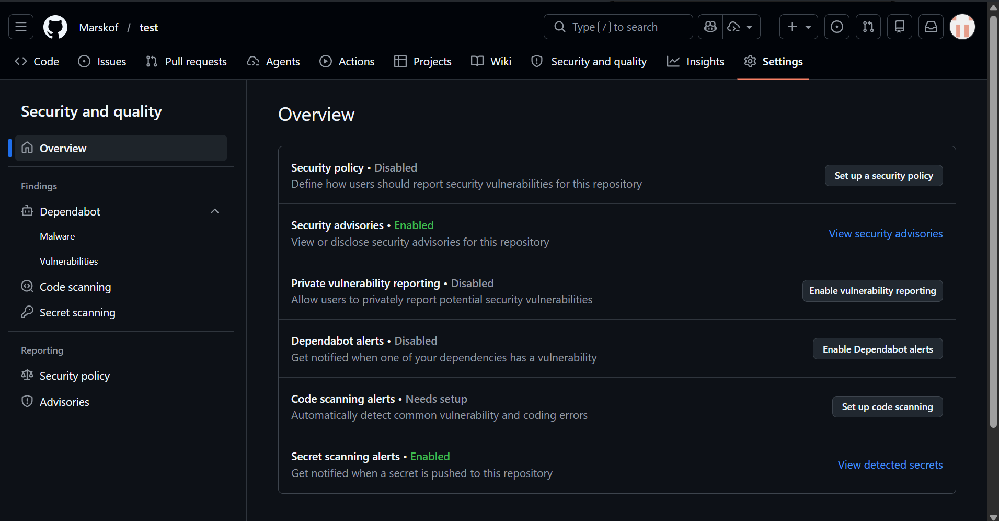

# Marouane MANAR
## Projet MIAGE Bank - Partie A et B

L'ensemble des livrables de ce TP se trouve dans ce répertoire.

---

# Partie A — Chaîne de build OCI avec Buildah, Trivy et Dive

## 1. Analyse comparative Docker vs Buildah
L'analyse comparative détaillée entre l'architecture classique de Docker et l'architecture "Daemonless/Rootless" de Buildah est disponible dans le fichier dédié à la racine : [`ANALYSE_COMPARATIVE_DOCKER_BUILDAH.md`](./ANALYSE_COMPARATIVE_DOCKER_BUILDAH.md).

## 2. Build de MIAGE-Bank avec Buildah

L'objectif de cette partie est de faire un build de l'ensemble des services (6 services back et 1 front) de l'application MIAGE-Bank avec Buildah (build OCI)

L'application source `MIAGE-Bank` étant architecturée en micro-services (6 services dans le dossier `miage-bank-back`), j'ai fait le choix de conteneuriser l'ensemble de l'application. Au lieu d'avoir 6 fois le même fichier, j'ai préféré utiliser un seul `ContainerFile` partagé. Cela me permet d'avoir une configuration homogène pour tous les services. Dans le projet Miage Bank, cette approche est suffisante telle quelle, mais on aurait pu avoir plusieurs `ContainerFile` si les services avaient eu des besoins différents.

### Approche 1 : Via un Containerfile
Le script `build_all.sh` gère cette première approche :
1. Il compile tout le projet Java globalement avec Maven.
2. Il construit une image Nginx pour la partie front.
3. Il boucle sur chaque micro-service pour exécuter Buildah en utilisant le `ContainerFile` commun, en adaptant le contexte de build pour cibler le `.jar` correct. 

> **Note** : le contexte de build correspond aux fichiers rendus accessibles à Buildah au moment de la construction. Ici, il est ajusté pour que chaque service ne copie que les éléments nécessaires, notamment le bon fichier `.jar`.

_Exécution locale :_ `./build_all.sh`

### Approche 2 : Construction layer par layer en mode natif Buildah
Le script `build_native.sh` gère cette méthode. Il réalise la même boucle sur tous les micro-services, mais utilise les commandes natives (`buildah from`, `buildah config`, `buildah copy`, `buildah commit`) plutôt qu'un `Containerfile`. 

### Comparaison des résultats

Le résultat final est le même, mais la méthode de construction est différente. La méthode avec ContainerFile est plus lisible et portable, tandis que la méthode layer-by-layer est plus flexible et s'intègre mieux dans des pipelines CI/CD. Elle permet d'écrire des scripts plus complexes, de gérer les erreurs de manière plus fine et d'utiliser des variables dynamiques ou des secrets directement dans les commandes, sans les écrire dans un fichier statique comme le ContainerFile.

Pour résumer, l'approche ContainerFile est plus lisible et compréhensible, mais moins flexible. La méthode layer-by-layer est plus flexible et s'intègre mieux dans des pipelines CI/CD, mais elle n'est pas standardisée et peut être plus difficile à maintenir. Il faut donc choisir la méthode de build en fonction du contexte.

| Critère | ContainerFile | Layer-by-layer |
|---|---|---|
| Lisibilité | Très bonne | Moyenne |
| Portabilité | Très bonne | Moyenne |
| Flexibilité | Plus faible | Très forte |
| Intégration CI/CD | Bonne | Très bonne |
| Gestion des variables et secrets | Moins adaptée | Très adaptée |
| Maintenabilité | Bonne | Plus délicate |
| Standardisation | Oui | Non |

## 3. Scan de sécurité avec Trivy

Pour automatiser nos audits, le script `generate_trivy_report.sh` va exporter et filtrer nos 7 images générées, afin de produire pour chacune le rapport JSON et SARIF. Les fichiers seront stockés dans le dossier `rapports_trivy/`. Lors d'un push, ces opérations sont exécutées automatiquement par la pipeline Github Actions.

### Analyse des résultats
L'image de base (`eclipse-temurin:17-jre-alpine`) s'avère robuste (quelques failles OS mineures). La majorité écrasante des failles proviennent des dépendances de l'applicatif Java (`app.jar`), qui totalise environ 40 vulnérabilités de haut niveau (36 HIGH, 4 CRITICAL).

### Détail des failles CRITICAL
* **CVE-2022-22965 (Spring4Shell)** : Faille de type Remote Code Execution (RCE) via le Data Binding de Spring MVC ou WebFlux fonctionnant sur JDK 9+. C'est la vulnérabilité la plus critique identifiée.
* **CVE-2016-1000027** : Faille liée à la désérialisation non sécurisée d'objets Java via `HttpInvokerServiceExporter` dans `spring-web`. Cela peut permettre l'exécution de code arbitraire s'il est exploité.
* **CVE-2023-20873** : Vulnérabilité de contournement de sécurité (Security Bypass) sur Spring Boot Actuator.
* **CVE-2023-20860** : Faille de contournement de sécurité (Security Bypass) liée au filtrage `mvcRequestMatcher` de Spring Security via un motif non préfixé. Elle affecte le paquet `spring-webmvc`.

*(Il existe également environ 36 failles HIGH portant principalement sur des bibliothèques comme `tomcat-embed-core`, diverses librairies `spring-web`/`spring-core`, `jettison` et `snakeyaml`)*.

### Plan de remédiation global
Ces vulnérabilités découlent toutes d'une seule et même racine : **L'utilisation d'une version très obsolète de Spring Boot (la 2.6.4)** dans le fichier `pom.xml` parent du projet fourni pour le TP.
1. **Action requise** : Il faudrait le projet vers une version moderne et sécurisée comme **Spring Boot 3.3.x ou 3.4.x**. Cela mettra instantanément à jour toutes les dépendances (dont `tomcat-embed-core`, `spring-web`, `snakeyaml`, etc.) vers des versions patchées.
2. **Pour le système OS (Alpine)** : Mettre à jour l'image de base (`temurin:17-jre-alpine`) régulièrement pour embarquer les derniers correctifs de paquets via l'utilisation rigoureuse des derniers *digests* OCI.

> **Note** : un digest OCI est l'identifiant immuable d'une image, calculé à partir de son contenu. Il permet de garantir qu'on télécharge exactement la même version de l'image, sans dépendre d'un simple tag qui peut évoluer.

> **Remarque sur la gate de sécurité** :
> En temps normal, on aurait du configurer Trivy pour faire échouer le build en cas de faille détectée (via l'option `--exit-code 1`). Le problème ici, c'est que le code du TP utilise des versions de Spring tellement anciennes qu'il y a d'office 4 failles CRITICAL bloquantes. J'ai donc dû "baisser le niveau de sécurité attendu". Les rapports JSON et SARIF sont générés pour audit, mais la pipeline CI n'est pas bloquée.

## 4. Audit de l'image avec Dive

L'outil **Dive** a été configuré via le fichier `.dive-ci` qui servira à la pipeline Github Actions. Les seuils sont :
- Efficacité minimale : **95%**
- Espace gaspillé maximum : **20 MB**
- Pourcentage d'espace gaspillé maximum : **10%**

### Taille de chaque layer et taille totale des images

L'architecture étant standardisée, tous les micro-services back-end (Java) partagent exactement la même structure de layers. Voici la décomposition détaillée d'une image Java type :

> **Note** : dans une image OCI, un *layer* est une couche superposée de fichiers. Chaque instruction du build peut ajouter une couche nouvelle ou une modification à l'image finale. Dans ce projet, l'essentiel de la taille vient de l'image de base Java, puis du fichier `app.jar` copié au moment du build.

- **Taille totale de l'image** : ~180 MB
- **Layer 1** (image de base `eclipse-temurin:17-jre-alpine`) : ~155 MB
- **Layer 2** (copie du fichier `app.jar`) : variable selon le service (environ 20 à 30 MB)
- **Métadonnées de configuration** (`WORKDIR`, `EXPOSE`, `CMD`) : impact négligeable sur la taille

Pour le micro-service Front-end, l'image est basée sur `nginx:alpine` avec la simple copie des fichiers statiques HTML/CSS/JS.

**Tableau récapitulatif des audits pour l'ensemble des conteneurs :**

| Nom de l'image | Espace gaspillé (Wasted) | Score d'Efficience | Passage de la Gate |
|---|---|---|---|
| `banque-annuaire` | 645 kB | 99.82 % | ✅ PASS |
| `banque-configserver` | 645 kB | 99.82 % | ✅ PASS |
| `banque-clientservice` | 645 kB | 99.83 % | ✅ PASS |
| `banque-compteservice` | 645 kB | 99.82 % | ✅ PASS |
| `banque-compositeservice` | 645 kB | 99.82 % | ✅ PASS |
| `banque-apigateway` | 645 kB | 99.82 % | ✅ PASS |
| `miage-bank-front` (Nginx) | 638 kB | 99.36 % | ✅ PASS |

*(L'espace gaspillé extrêmement faible provient majoritairement des certificats racines et de quelques fichiers système Alpine).*

*(L'ensemble des exports d'analyse Dive sont disponibles dans le sous-dossier `rapports_dive/`).*

### Optimisation et approche "Avant / Après"
Pour répondre à l'exigence d'optimisation, j'ai fait le choix de ne pas faire d'avant/après classique. En effet, le projet a été conçu pour qu'il soit optimisé dès le départ (à l'étape 2) en séparant la compilation du packaging.

Si le projet avait directement été compilé dans le `ContainerFile` avec une image de base très lourde (`openjdk:17`), Dive aurait détecté beaucoup de fichiers superflus,ce qui aurait fait chuter le score d'efficacité et créé une image beaucoup plus lourde et finalement, cela aurait peut être empêcher de passer la gate. 

A la place, j'ai externalisé la compilation (via le script `build_all.sh`) sur la machine hôte. Le `ContainerFile` ne s'occupe que de copier le fichier `app.jar` généré dans une image `eclipse-temurin:17-jre-alpine`. Cela simule le comportement d'un *multi-stage build*, ce qui garantit de ne copier aucun élément superflu et d'avoir un très bon score sur l'audit Dive. Dans le cas du projet, c'est la meilleure méthode.

## 5. Script de build intégré (CI Github Actions)

Pour automatiser l'intégralité de la chaîne d'intégration continue, une pipeline Github Actions a été développée dans le fichier `../../.github/workflows/ci.yml`.

Cette pipeline se déclenche sur `push` et `pull_request` vers la branche `main`, puis exécute les étapes suivantes :
1. **Préparation de l'environnement** : Checkout du code, setup Java 17 et installation de Buildah sur le runner.
2. **Compilation Java** : Génération des binaires locaux via `mvn clean package`.
3. **Linting du ContainerFile** : Utilisation de `hadolint/hadolint-action` pour valider les bonnes pratiques OCI.
4. **Conteneurisation (Buildah)** : Exploitation du script `build_all.sh` pour générer les 7 images (6 Backends + 1 Frontend) et export sous forme d'archives locales (`.tar`).
5. **Scan de Sécurité (Trivy)** : Exécution du scan pour générer les rapports `JSON` et `SARIF`.
6. **Upload SARIF** : Publication des résultats dans l'onglet *GitHub Security*.
7. **Audit de gaspillage (Dive)** : Exécution de l'audit Dive respectant les seuils fixés (fichier `.dive-ci`) sur l'ensemble des archives.
8. **Archivage des rapports** : Upload de tous les artefacts (`build-reports`) en fin de pipeline.

> **Note** : les alertes peuvent ne pas apparaître dans l'onglet *Security* car je n'ai pas GitHub Advanced Security sur ce dépôt privé, même avec l'offre GitHub for Student. Dans tout les cas, les rapports SARIF/JSON restent disponibles dans les artefacts de la pipeline. Si le repo est en public, on a accès à l'onglet security. 



---


# Partie B — Déploiement Kubernetes avec Helm et ArgoCD

L'objectif de cette partie est de déployer l'architecture micro-services sur un cluster Kubernetes (avec Minikube en local), en utilisant démarche Helm. Ce déploiement assurera la  gestion des secrets via Vault et il permettra l'automatisation GitOps avec ArgoCD.

## 1. Création du chart Helm

Plutôt que de créer 7 Helm charts distincts (un pour chaque micro-service + un pour le frontend), j'ai regroupé l'ensemble du déploiement dans un seul Helm chart nommé `miage-bank`. Cela me permet d'éviter la redondance des fichiers YAML et de centraliser la gestion de tous les services. l'approche de faire plusieurs Helm chart était également possible.

Le fichier **template `deployment.yaml` unique** applique une boucle Helm (action `range`) pour générer dynamiquement les configurations de tous les services à partir de leur définition dans le fichier `values.yaml`.

### Fichiers de configuration du chart

- **values.yaml** : Contient la configuration de base pour tous les services : `imagePullPolicy`, ressources, variables d'environnement (telles que `wait_hosts`, ports).
- **values-prod.yaml** : Surcharge le fichier `values.yaml` pour simuler un environnement de production. Il modifie `imagePullPolicy` en `Always`, ajuste le nombre de réplicas pour certains services et définit des limites de ressources matérielles (CPU/Memory).
- **ConfigMap** : Regroupe les variables globales communes, comme l'URL du serveur Eureka de l'annuaire. Cette ConfigMap est injectée sur tous les services via le bloc `envFrom`.

## 2. Configuration réseau et sécurité Kubernetes (NetworkPolicy, RBAC, HPA)

Pour sécuriser les flux réseau, j'ai mis en place une `NetworkPolicy`. Le namespace `miage-bank` est ainsi isolé par défaut, avec deux règles principales :

> **Note** : une `NetworkPolicy` est un objet Kubernetes qui définit les règles de communication réseau entre les pods. Elle fonctionne selon le principe du *deny-all* par défaut (tous les flux sont interdits, sauf ceux explicitement autorisés).

- **Trafic interne** : Le trafic entre les pods de `miage-bank` est explicitement autorisé, ce qui est nécessaire à la communication inter-services.
- **Point d'entrée unique** : Seul le trafic entrant provenant de l'Ingress Controller Traefik (situé dans le namespace `kube-system`) est accepté depuis l'extérieur. Cela constitue notre unique point d'entrée vers l'application.

### RBAC (Role-Based Access Control)

Concernant la gestion des rôles, j'ai créé un compte de service (`ServiceAccount`) dédié à l'application nommé `miage-bank-sa`. Cela permet de :
- **Isoler les permissions** : Chaque pod de l'application s'authentifie uniquement avec ce compte de service.
- **Restreindre l'accès** : Les permissions sont limitées au strict nécessaire pour le fonctionnement de l'application, selon le principe du moindre privilège.

### HPA (Horizontal Pod Autoscaler)

J'ai également configuré un `HPA` pour ajuster automatiquement le nombre de réplicas de certains services en fonction de la charge. Cela permet un déploiement plus robuste.


## 3. Sécurisation des secrets avec Vault et External Secrets Operator

L'objectif de cette étape était de sécuriser la gestion des secrets (identifiants MySQL et MongoDB) sans jamais les commiter en clair dans le dépôt Git. J'ai utilisé Hashicorp Vault couplé à External Secrets Operator (ESO) pour mettre en place un flux d'authentification sécurisé et automatisé :

1. **Stockage des secrets dans Vault** : Les mots de passe des bases de données sont stockés directement dans le moteur KV de Vault. Cela élimine le besoin de les stocker sous forme de fichiers statiques ou de variables d'environnement en clair.

2. **Authentification Kubernetes vers Vault** : Pour que le cluster Kubernetes puisse accéder à Vault de manière sécurisée, j'ai configuré la méthode `kubernetes` auth dans Vault. Cette méthode d'authentification utilise le token de service account Kubernetes pour valider l'identité du cluster. J'ai également créé un rôle qui limite l'accès strictement au compte de service de l'application (`miage-bank-sa`) via une politique spécifique (`miage-policy`).

3. **Récupération automatique par ESO** : L'opérateur External Secrets Operator (ESO) surveille les ressources Kubernetes et interagit avec Vault pour lire les données sécurisées. ESO génère alors des objets `Secret` natifs Kubernetes dans le namespace de l'application, qui sont injectés dans l'environnement des pods via le bloc `envFrom`.

## 4. Déploiement GitOps avec ArgoCD

Le déploiement du chart Helm a été configuré avec ArgoCD via le manifeste `argocd/application.yaml` pointant vers notre dépôt.

La politique de synchronisation a été définie sur `automated` avec deux paramètres importants :
- **Prune** : Supprime les objets Kubernetes locaux qui ne sont plus déclarés dans les fichiers du dépôt Git.
- **SelfHeal** : Corrige automatiquement tout écart entre l'état du cluster et le code présent sur GitHub.

Le projet est bien déployé et de nouveau accessible localement via l'Ingress Traefik sur l'adresse `miage-bank.local`.

> **Note** : sous Windows avec WSL, l'accès via l'Ingress peut être problématique. La commande `minikube tunnel` ne fonctionne pas forcément de façon fiable.


## 5. Exercice de Dérive (Drift) et Auto-Heal

Pour valider l'approche GitOps implémentée par ArgoCD, un test a été fait sur le cluster en modifiant manuellement le nombre de réplicas du pod front-end avec l'outil en ligne de commande :

```bash
kubectl scale deployment miage-bank-app-miage-bank-front -n miage-bank --replicas=3
```

**Observation de la réconciliation :**
## 2. Build de MIAGE-Bank avec Buildah

L'objectif de cette partie est de faire un build de l'ensemble des services (6 services back et 1 front) de l'application MIAGE-Bank avec Buildah (build OCI)

L'application source `MIAGE-Bank` étant architecturée en micro-services (6 services dans le dossier `miage-bank-back`), j'ai fait le choix de conteneuriser l'ensemble de l'application. Au lieu d'avoir 6 fois le même fichier, j'ai préféré utiliser un seul `ContainerFile` partagé. Cela me permet d'avoir une configuration homogène pour tous les services. Dans le projet Miage Bank, cette approche est suffisante telle quelle, mais on aurait pu avoir plusieurs `ContainerFile` si les services avaient eu des besoins différents.

### Approche 1 : Via un Containerfile
Le script `build_all.sh` gère cette première approche :
1. Il compile tout le projet Java globalement avec Maven.
2. Il construit une image Nginx pour la partie front.
3. Il boucle sur chaque micro-service pour exécuter Buildah en utilisant le `ContainerFile` commun, en adaptant le contexte de build pour cibler le `.jar` correct. 

> **Note** : le contexte de build correspond aux fichiers rendus accessibles à Buildah au moment de la construction. Ici, il est ajusté pour que chaque service ne copie que les éléments nécessaires, notamment le bon fichier `.jar`.

_Exécution locale :_ `./build_all.sh`

### Approche 2 : Construction layer par layer en mode natif Buildah
Le script `build_native.sh` gère cette méthode. Il réalise la même boucle sur tous les micro-services, mais utilise les commandes natives (`buildah from`, `buildah config`, `buildah copy`, `buildah commit`) plutôt qu'un `Containerfile`. 

### Comparaison des résultats

Le résultat final est le même, mais la méthode de construction est différente. La méthode avec ContainerFile est plus lisible et portable, tandis que la méthode layer-by-layer est plus flexible et s'intègre mieux dans des pipelines CI/CD. Elle permet d'écrire des scripts plus complexes, de gérer les erreurs de manière plus fine et d'utiliser des variables dynamiques ou des secrets directement dans les commandes, sans les écrire dans un fichier statique comme le ContainerFile.

Pour résumer, l'approche ContainerFile est plus lisible et compréhensible, mais moins flexible. La méthode layer-by-layer est plus flexible et s'intègre mieux dans des pipelines CI/CD, mais elle n'est pas standardisée et peut être plus difficile à maintenir. Il faut donc choisir la méthode de build en fonction du contexte.

| Critère | ContainerFile | Layer-by-layer |
|---|---|---|
| Lisibilité | Très bonne | Moyenne |
| Portabilité | Très bonne | Moyenne |
| Flexibilité | Plus faible | Très forte |
| Intégration CI/CD | Bonne | Très bonne |
| Gestion des variables et secrets | Moins adaptée | Très adaptée |
| Maintenabilité | Bonne | Plus délicate |
| Standardisation | Oui | Non |

## 3. Scan de sécurité avec Trivy

Pour automatiser nos audits, le script `generate_trivy_report.sh` va exporter et filtrer nos 7 images générées, afin de produire pour chacune le rapport JSON et SARIF. Les fichiers seront stockés dans le dossier `rapports_trivy/`. Lors d'un push, ces opérations sont exécutées automatiquement par la pipeline Github Actions.

### Analyse des résultats
L'image de base (`eclipse-temurin:17-jre-alpine`) s'avère robuste (quelques failles OS mineures). La majorité écrasante des failles proviennent des dépendances de l'applicatif Java (`app.jar`), qui totalise environ 40 vulnérabilités de haut niveau (36 HIGH, 4 CRITICAL).

### Détail des failles CRITICAL
* **CVE-2022-22965 (Spring4Shell)** : Faille de type Remote Code Execution (RCE) via le Data Binding de Spring MVC ou WebFlux fonctionnant sur JDK 9+. C'est la vulnérabilité la plus critique identifiée.
* **CVE-2016-1000027** : Faille liée à la désérialisation non sécurisée d'objets Java via `HttpInvokerServiceExporter` dans `spring-web`. Cela peut permettre l'exécution de code arbitraire s'il est exploité.
* **CVE-2023-20873** : Vulnérabilité de contournement de sécurité (Security Bypass) sur Spring Boot Actuator.
* **CVE-2023-20860** : Faille de contournement de sécurité (Security Bypass) liée au filtrage `mvcRequestMatcher` de Spring Security via un motif non préfixé. Elle affecte le paquet `spring-webmvc`.

*(Il existe également environ 36 failles HIGH portant principalement sur des bibliothèques comme `tomcat-embed-core`, diverses librairies `spring-web`/`spring-core`, `jettison` et `snakeyaml`)*.

### Plan de remédiation global
Ces vulnérabilités découlent toutes d'une seule et même racine : **L'utilisation d'une version très obsolète de Spring Boot (la 2.6.4)** dans le fichier `pom.xml` parent du projet fourni pour le TP.
1. **Action requise** : Il faudrait le projet vers une version moderne et sécurisée comme **Spring Boot 3.3.x ou 3.4.x**. Cela mettra instantanément à jour toutes les dépendances (dont `tomcat-embed-core`, `spring-web`, `snakeyaml`, etc.) vers des versions patchées.
2. **Pour le système OS (Alpine)** : Mettre à jour l'image de base (`temurin:17-jre-alpine`) régulièrement pour embarquer les derniers correctifs de paquets via l'utilisation rigoureuse des derniers *digests* OCI.

> **Note** : un digest OCI est l'identifiant immuable d'une image, calculé à partir de son contenu. Il permet de garantir qu'on télécharge exactement la même version de l'image, sans dépendre d'un simple tag qui peut évoluer.

> **Remarque sur la gate de sécurité** :
> En temps normal, on aurait du configurer Trivy pour faire échouer le build en cas de faille détectée (via l'option `--exit-code 1`). Le problème ici, c'est que le code du TP utilise des versions de Spring tellement anciennes qu'il y a d'office 4 failles CRITICAL bloquantes. J'ai donc dû "baisser le niveau de sécurité attendu". Les rapports JSON et SARIF sont générés pour audit, mais la pipeline CI n'est pas bloquée.

## 4. Audit de l'image avec Dive

L'outil **Dive** a been configuré via le fichier `.dive-ci` qui servira à la pipeline Github Actions. Les seuils sont :
- Efficacité minimale : **95%**
- Espace gaspillé maximum : **20 MB**
- Pourcentage d'espace gaspillé maximum : **10%**

### Taille de chaque layer et taille totale des images

L'architecture étant standardisée, tous les micro-services back-end (Java) partagent exactement la même structure de layers. Voici la décomposition détaillée d'une image Java type :

> **Note** : dans une image OCI, un *layer* est une couche superposée de fichiers. Chaque instruction du build peut ajouter une couche nouvelle ou une modification à l'image finale. Dans ce projet, l'essentiel de la taille vient de l'image de base Java, puis du fichier `app.jar` copié au moment du build.

- **Taille totale de l'image** : ~180 MB
- **Layer 1** (image de base `eclipse-temurin:17-jre-alpine`) : ~155 MB
- **Layer 2** (copie du fichier `app.jar`) : variable selon le service (environ 20 à 30 MB)
- **Métadonnées de configuration** (`WORKDIR`, `EXPOSE`, `CMD`) : impact négligeable sur la taille

Pour le micro-service Front-end, l'image est basée sur `nginx:alpine` avec la simple copie des fichiers statiques HTML/CSS/JS.

**Tableau récapitulatif des audits pour l'ensemble des conteneurs :**

| Nom de l'image | Espace gaspillé (Wasted) | Score d'Efficience | Passage de la Gate |
|---|---|---|---|
| `banque-annuaire` | 645 kB | 99.82 % | ✅ PASS |
| `banque-configserver` | 645 kB | 99.82 % | ✅ PASS |
| `banque-clientservice` | 645 kB | 99.83 % | ✅ PASS |
| `banque-compteservice` | 645 kB | 99.82 % | ✅ PASS |
| `banque-compositeservice` | 645 kB | 99.82 % | ✅ PASS |
| `banque-apigateway` | 645 kB | 99.82 % | ✅ PASS |
| `miage-bank-front` (Nginx) | 638 kB | 99.36 % | ✅ PASS |

*(L'espace gaspillé extrêmement faible provient majoritairement des certificats racines et de quelques fichiers système Alpine).*

*(L'ensemble des exports d'analyse Dive sont disponibles dans le sous-dossier `rapports_dive/`).*

### Optimisation et approche "Avant / Après"
Pour répondre à l'exigence d'optimisation, j'ai fait le choix de ne pas faire d'avant/après classique. En effet, le projet a été conçu pour qu'il soit optimisé dès le départ (à l'étape 2) en séparant la compilation du packaging.

Si le projet avait directement été compilé dans le `ContainerFile` avec une image de base très lourde (`openjdk:17`), Dive aurait détecté beaucoup de fichiers superflus,ce qui aurait fait chuter le score d'efficacité et créé une image beaucoup plus lourde et finalement, cela aurait peut être empêcher de passer la gate. 

A la place, j'ai externalisé la compilation (via le script `build_all.sh`) sur la machine hôte. Le `ContainerFile` ne s'occupe que de copier le fichier `app.jar` généré dans une image `eclipse-temurin:17-jre-alpine`. Cela simule le comportement d'un *multi-stage build*, ce qui garantit de ne copier aucun élément superflu et d'avoir un très bon score sur l'audit Dive. Dans le cas du projet, c'est la meilleure méthode.

## 5. Script de build intégré (CI Github Actions)

Pour automatiser l'intégralité de la chaîne d'intégration continue, une pipeline Github Actions a été développée dans le fichier `../../.github/workflows/ci.yml`.

Cette pipeline se déclenche sur `push` et `pull_request` vers la branche `main`, puis exécute les étapes suivantes :
1. **Préparation de l'environnement** : Checkout du code, setup Java 17 et installation de Buildah sur le runner.
2. **Compilation Java** : Génération des binaires locaux via `mvn clean package`.
3. **Linting du ContainerFile** : Utilisation de `hadolint/hadolint-action` pour valider les bonnes pratiques OCI.
4. **Conteneurisation (Buildah)** : Exploitation du script `build_all.sh` pour générer les 7 images (6 Backends + 1 Frontend) et export sous forme d'archives locales (`.tar`).
5. **Scan de Sécurité (Trivy)** : Exécution du scan pour générer les rapports `JSON` et `SARIF`.
6. **Upload SARIF** : Publication des résultats dans l'onglet *GitHub Security*.
7. **Audit de gaspillage (Dive)** : Exécution de l'audit Dive respectant les seuils fixés (fichier `.dive-ci`) sur l'ensemble des archives.
8. **Archivage des rapports** : Upload de tous les artefacts (`build-reports`) en fin de pipeline.

> **Note** : les alertes peuvent ne pas apparaître dans l'onglet *Security* car je n'ai pas GitHub Advanced Security sur ce dépôt privé, même avec l'offre GitHub for Student. Dans tout les cas, les rapports SARIF/JSON restent disponibles dans les artefacts de la pipeline. Si le repo est en public, on a accès à l'onglet security. 


---


# Partie B — Déploiement Kubernetes avec Helm et ArgoCD

L'objectif de cette partie est de déployer l'architecture micro-services sur un cluster Kubernetes (avec Minikube en local), en utilisant démarche Helm. Ce déploiement assurera la  gestion des secrets via Vault et il permettra l'automatisation GitOps avec ArgoCD.

## 1. Création du chart Helm

Plutôt que de créer 7 Helm charts distincts (un pour chaque micro-service + un pour le frontend), j'ai regroupé l'ensemble du déploiement dans un seul Helm chart nommé `miage-bank`. Cela me permet d'éviter la redondance des fichiers YAML et de centraliser la gestion de tous les services. l'approche de faire plusieurs Helm chart était également possible.

Le fichier **template `deployment.yaml` unique** applique une boucle Helm (action `range`) pour générer dynamiquement les configurations de tous les services à partir de leur définition dans le fichier `values.yaml`.

### Fichiers de configuration du chart

- **values.yaml** : Contient la configuration de base pour tous les services : `imagePullPolicy`, ressources, variables d'environnement (telles que `wait_hosts`, ports).
- **values-prod.yaml** : Surcharge le fichier `values.yaml` pour simuler un environnement de production. Il modifie `imagePullPolicy` en `Always`, ajuste le nombre de réplicas pour certains services et définit des limites de ressources matérielles (CPU/Memory).
- **ConfigMap** : Regroupe les variables globales communes, comme l'URL du serveur Eureka de l'annuaire. Cette ConfigMap est injectée sur tous les services via le bloc `envFrom`.

## 2. Configuration réseau et sécurité Kubernetes (NetworkPolicy, RBAC, HPA)

Pour sécuriser les flux réseau, j'ai mis en place une `NetworkPolicy`. Le namespace `miage-bank` est ainsi isolé par défaut, avec deux règles principales :

> **Note** : une `NetworkPolicy` est un objet Kubernetes qui définit les règles de communication réseau entre les pods. Elle fonctionne selon le principe du *deny-all* par défaut (tous les flux sont interdits, sauf ceux explicitement autorisés).

- **Trafic interne** : Le trafic entre les pods de `miage-bank` est explicitement autorisé, ce qui est nécessaire à la communication inter-services.
- **Point d'entrée unique** : Seul le trafic entrant provenant de l'Ingress Controller Traefik (situé dans le namespace `kube-system`) est accepté depuis l'extérieur. Cela constitue notre unique point d'entrée vers l'application.

### RBAC (Role-Based Access Control)

Concernant la gestion des rôles, j'ai créé un compte de service (`ServiceAccount`) dédié à l'application nommé `miage-bank-sa`. Cela permet de :
- **Isoler les permissions** : Chaque pod de l'application s'authentifie uniquement avec ce compte de service.
- **Restreindre l'accès** : Les permissions sont limitées au strict nécessaire pour le fonctionnement de l'application, selon le principe du moindre privilège.

### HPA (Horizontal Pod Autoscaler)

J'ai également configuré un `HPA` pour ajuster automatiquement le nombre de réplicas de certains services en fonction de la charge. Cela permet un déploiement plus robuste.


## 3. Sécurisation des secrets avec Vault et External Secrets Operator

L'objectif de cette étape était de sécuriser la gestion des secrets (identifiants MySQL et MongoDB) sans jamais les commiter en clair dans le dépôt Git. J'ai utilisé Hashicorp Vault couplé à External Secrets Operator (ESO) pour mettre en place un flux d'authentification sécurisé et automatisé :

1. **Stockage des secrets dans Vault** : Les mots de passe des bases de données sont stockés directement dans le moteur KV de Vault. Cela élimine le besoin de les stocker sous forme de fichiers statiques ou de variables d'environnement en clair.

2. **Authentification Kubernetes vers Vault** : Pour que le cluster Kubernetes puisse accéder à Vault de manière sécurisée, j'ai configuré la méthode `kubernetes` auth dans Vault. Cette méthode d'authentification utilise le token de service account Kubernetes pour valider l'identité du cluster. J'ai également créé un rôle qui limite l'accès strictement au compte de service de l'application (`miage-bank-sa`) via une politique spécifique (`miage-policy`).

3. **Récupération automatique par ESO** : L'opérateur External Secrets Operator (ESO) surveille les ressources Kubernetes et interagit avec Vault pour lire les données sécurisées. ESO génère alors des objets `Secret` natifs Kubernetes dans le namespace de l'application, qui sont injectés dans l'environnement des pods via le bloc `envFrom`.

## 4. Déploiement GitOps avec ArgoCD

Le déploiement du chart Helm a été configuré avec ArgoCD via le manifeste `argocd/application.yaml` pointant vers notre dépôt.

La politique de synchronisation a été définie sur `automated` avec deux paramètres importants :
- **Prune** : Supprime les objets Kubernetes locaux qui ne sont plus déclarés dans les fichiers du dépôt Git.
- **SelfHeal** : Corrige automatiquement tout écart entre l'état du cluster et le code présent sur GitHub.

Le projet est bien déployé et de nouveau accessible localement via l'Ingress Traefik sur l'adresse `miage-bank.local`.

> **Note** : sous Windows avec WSL, l'accès via l'Ingress peut être problématique. La commande `minikube tunnel` ne fonctionne pas forcément de façon fiable.


## 5. Exercice de Dérive (Drift) et Auto-Heal

Pour valider l'approche GitOps implémentée par ArgoCD, un test a été fait sur le cluster en modifiant manuellement le nombre de réplicas du pod front-end avec l'outil en ligne de commande :

```bash
kubectl scale deployment miage-bank-app-miage-bank-front -n miage-bank --replicas=3
```

**Observation de la réconciliation :**
Dès la création forcée des pods, le contrôleur ArgoCD a basculé l'état de l'application en `OutOfSync`. Grâce à l'activation de l'option `SelfHeal` dans sa configuration, ArgoCD a relu l'état désiré (sur Git, défini à 1 réplica) et a initié la terminaison immédiate des pods en sur-nombre.

```text
miage-bank-app-miage-bank-front-cc4cbbd47-dqnmg           0/1     ContainerCreating   0               4s
miage-bank-app-miage-bank-front-cc4cbbd47-g28c4           0/1     ContainerCreating   0               4s
miage-bank-app-miage-bank-front-cc4cbbd47-q8s9f           1/1     Running             0               41m
miage-bank-app-miage-bank-front-cc4cbbd47-g28c4           0/1     Terminating         0               11s
miage-bank-app-miage-bank-front-cc4cbbd47-dqnmg           0/1     Terminating         0               11s
```

Ce test permet de certifier que le dépôt Git conserve bien son rôle de Single Source of Truth, neutralisant de fait toute modification manuelle non suivie.

## 6. Résolution des anomalies de démarrage (Troubleshooting)

Lors du passage de Docker Compose à Kubernetes, j'ai rencontré quelques crashs (`CrashLoopBackOff`) au démarrage des pods. J'ai donc apporté quelques correctifs dans le Helm Chart pour stabiliser le cluster :

- **Rétrocompatibilité DNS** : Les microservices cherchaient à joindre des hôtes comme `bnkmysql`. Pour éviter de retoucher le code Java, j'ai ajouté un fichier `aliases.yaml` qui utilise des services de type `ExternalName` pour faire la correspondance avec les vrais noms Kubernetes.
- **Profil Spring Boot** : Par défaut, le profil `default` était chargé, ce qui empêchait la récupération des URLs des bases de données. J'ai injecté `SPRING_PROFILES_ACTIVE: "docker"` via la `ConfigMap`.
- **Ports Tomcat** : Sans précision, Tomcat démarrait sur le port `8080`, ce qui faisait échouer les sondes Kubernetes (configurées sur `10021`, etc.). J'ai donc ajouté une injection de variable `SERVER_PORT: "{{ $svc.port }}"` dans mon `deployment.yaml`.
- **Réglage des sondes** : J'ai remarqué qu'une `readinessProbe` trop longue sur l'Annuaire bloquait le trafic réseau et faisait planter les autres conteneurs par effet domino (timeout). J'ai réduit la `readinessProbe` à 30 secondes, tout en conservant 120 secondes pour la `livenessProbe` afin de laisser le temps à Spring Boot de démarrer.
